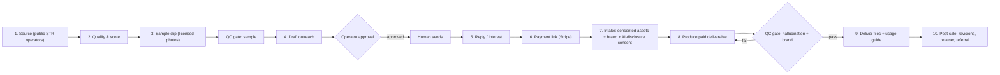

# Version A: rental video service specification

> **Status: `spec_only`.** Read [README.md](./README.md) first for positioning and guardrails. This
> spec inherits Jarvis's operator-approval gate: nothing here authorizes a send, a charge, or
> scraping hidden contact data.

## 1. Overview

This design proposes an AI video service for reachable short-term-rental operators. The
system sources operators who have a **public** contact channel and an **owned** marketing channel
(direct-booking site, Vrbo, active social), produces a short **sample** clip from photos licensed for this use, drafts a compliant outreach message for **human approval**, collects payment and
**consented, operator-owned assets** on acceptance, generates the paid deliverable, passes it through
a mandatory **QC gate**, and delivers files plus a channel-by-channel usage guide.

The deliverable is **marketing content for the operator's owned channels**: never an "Airbnb
listing conversion" promise.

## 2. Where it lives in Jarvis

Implement the pipeline as a **new client-style automation** inside the existing control plane,
reusing rather than reinventing infrastructure:

- Runs as a registered worker set under `src/agents` supervisor, so every run emits the standard
  Mermaid trace, `agent_runs` record, and audit entry.

- Outreach and payment requests route through the **same no-send boundary** the supervisor already
  enforces (`blocked_pending_operator_review`). Jarvis produces a reviewable artifact. A human
  performs the actual send/charge.

- Prospect and buyer data live in a **client-scoped compartment** (isolated SQLite, per the client
  template): never in the core DB.

- Config/policy is Zod-validated like existing clients.

## 3. Components

### 3.1 Sourcing (`source`)

- **Inputs:** target market(s), "upscale" thresholds (ADR, bedroom count, amenity flags).

- **Sources (public only):** Vrbo public listings. Direct-booking sites found via search
  (`"book direct" + <city> + vacation rental`). Instagram STR accounts. Public property-manager
  directories. AirDNA/AirROI market data for upscale filtering. **Explicitly excluded:** any tool
  that harvests Airbnb host emails/phones (excluded by this project).

- **Output:** `lead` records: business/operator label, public channel(s) (website form, public
  email, IG handle), source URL, upscale signal, owned-channel signal. **No** personal names,
  homeowner data, or private contact scraping.

### 3.2 Qualification & scoring (`qualify`)

- Score each lead on: upscale signal, has an owned channel that accepts video, has a reachable public
  contact, jurisdiction and channel-specific contact permission. Start with US businesses after review.
  Keep UK/EU individual and sole-trader contacts consent-required under this project policy.

- Output: ranked shortlist with a machine-readable `reachable` and `owned_channel` boolean. Drop
  anything failing either.

### 3.3 Sample generation (`sample`)

- Use photos with documented permission or a license covering sample generation. Generate a short (≤15s) vertical social clip via a
  real-estate photo-to-video API (Pedra / Luma / VideoTour.ai). Optional social punch-up (music,
  captions) via a generative tool.

- **AI-motion disclosure** label rendered on the sample.

- **QC gate (sample):** human/automated check for obvious hallucination artifacts. Regenerate a failed sample once, then skip the lead if it still fails.

- **Use limit:** the sample is a 1:1 outreach demo only. Do not publish it. Record the permitted use, source rights, and disclosure.
  Keeping a sample private does not replace permission to use its source photos.

### 3.4 Outreach drafting (`outreach`): GATED

- Draft a short message that cites one true public fact. Link the permitted sample and state the offer and price. CAN-SPAM elements (accurate header/subject,
  identification, physical postal address, one-click opt-out). No fabricated claims, no booking-lift
  promise.

- **Operator-approval gate:** Jarvis writes recipient + channel + subject + body + sender identity
  into a review record. A human approves **one** message at a time and performs the send. This is the
  existing `blocked_pending_operator_review` flow: reused, not rebuilt.

- Jurisdiction rule enforced here: review US business outreach against current law and channel terms.
  Project policy requires prior consent for UK/EU individual or sole-trader contacts.
  Refuse to queue a cold draft when the required permission is absent.

### 3.5 Sale & intake (`intake`)

- On interest, issue a Stripe payment link (human-approved). **Make-after-payment**: production
  starts only after payment clears.

- Intake form collects: operator-**owned** photos/short clips, brand preferences (colors, logo,
  music vibe), target channel(s), and an explicit **AI-disclosure + asset-ownership + usage consent**
  checkbox. Consent record is stored in the client compartment.

- Clear written scope: number of clips, length, one included revision round, delivery SLA, and an
  explicit "AI-generated motion from your photos" description to pre-empt "not as described"
  disputes.

### 3.6 Production (`produce`)

- Generate from **consented assets**: (a) 1-3 vertical social cuts (IG/FB/TikTok), (b) one longer walkthrough for a confirmed destination. The proposed preset is MP4,
  under two minutes, 9:16, and at least 1080×1920. Verify destination support before delivery.

- AI-motion disclosure label baked in. Deterministic pan/zoom preferred over heavy generative
  motion for the walkthrough to avoid inventing property details.

### 3.7 QC gate (`qc`): mandatory human sign-off

- Frame-review checklist: warped walls/mirrors/floors, morphing edges, impossible geometry, text
  legibility, brand correctness, disclosure label present, correct aspect/length per channel.

- **No delivery without a recorded human pass.** A fail loops back to production.

### 3.8 Delivery (`deliver`)

- Deliver files + a **usage guide** mapping each asset to a channel: post to IG/FB host groups, embed
  on the direct-booking site, use another platform only after checking account support and current rules.
  Do not propose an Airbnb listing or message link as a workaround.

### 3.9 Post-sale (`postsale`)

- One included revision round. A bounded revision policy beyond that.

- Upsell path: monthly **content retainer** (recurring social cuts): subject to separate approval and measured demand.

- Referral ask. Case-study consent capture (feeds Version B's proof pack).

### 3.10 Compliance & accounting (`ledger`)

- Records: consent artifacts, AI-disclosure, outreach approvals, CAN-SPAM opt-outs, disputes.

- Unit-economics ledger per order (tool credits spent, gateway fees, refunds) to validate margin.

## 4. Tech stack

- **Orchestration:** Jarvis supervisor/worker (TypeScript), reusing audit + Mermaid + no-send gate.

- **Video:** Evaluate Pedra first, with Luma and VideoTour.ai as alternatives.
  Confirm API access, rights, pricing, and output limits before selecting a provider. Abstract behind a `VideoProvider` interface so
  the engine is swappable.

- **Social punch-up (optional):** ViewMAX MCP or ffmpeg for captions/music/format.

- **Payments:** Stripe (payment links first. No stored card handling by Jarvis).

- **Data:** client-scoped SQLite compartment (existing client template).

- **Outreach transport:** human-operated mailbox / IG. Jarvis only drafts and stages.

## 5. Unit economics (targets, validate in pilot)

- Tool cost per deliverable: a planning assumption of $3-$8 in credits plus about 3% payment fees. Recheck actual charges.

- Price: **$149-$299** one-time per property (3 social cuts + 1 walkthrough), or **$199-$499/mo**
  retainer. These are proposed pilot prices, not validated market rates.

- Target contribution margin ≥ 80% before labor. Track closing, QC, and support labor separately.
  keep per-order human time under ~30 min to stay viable.

## 6. Non-goals / explicit exclusions

- No "boost your Airbnb bookings/conversion" claim or guarantee.

- No scraping of Airbnb hidden contact data. No messaging hosts via Airbnb to solicit (ToS breach).

- No speculative batch production. No samples from photos without the required permission.

- No unattended sending or charging: human gate always.

- No UK/EU cold outreach to individual/sole-trader operators without consent.

## 7. Risks & mitigations (carried from research)

| Risk                                        | Mitigation                                                                 |
| ------------------------------------------- | -------------------------------------------------------------------------- |
| AI hallucination misrepresents a real space | Mandatory QC gate. Deterministic motion for walkthrough. Disclosure label  |
| Copyright of listing photos                 | Require suitable rights for every sample and paid asset.                   |
| "Not as described" chargebacks              | Explicit AI-motion scope, one revision, make-after-payment, dispute log    |
| Low cold-outreach conversion                | Reachable-buyer targeting. Sample-led hook. Retainer upsell. Kill criteria |
| Airbnb ToS / platform strikes               | Compliant sourcing. No listing-video claims. No ToS-violating instructions |
| Overstated automation burning credits       | Per-order QC before spend where possible. Credit ledger. Failure caps      |

## 8. Definition of done (pipeline built, pre-pilot)

- Sourcing → sample → gated-draft runs end-to-end on **synthetic/self-owned** data, emitting the
  standard Jarvis run trace, with **zero** real sends or charges.

- QC gate and consent/intake flow implemented and tested.

- `VideoProvider` integrated against one real API using a **self-owned** test property.

- Unit-economics ledger produces a per-order cost/margin figure.

- Operator runbook exists. The pilot (real outreach) remains a separate, human-approved go decision.
